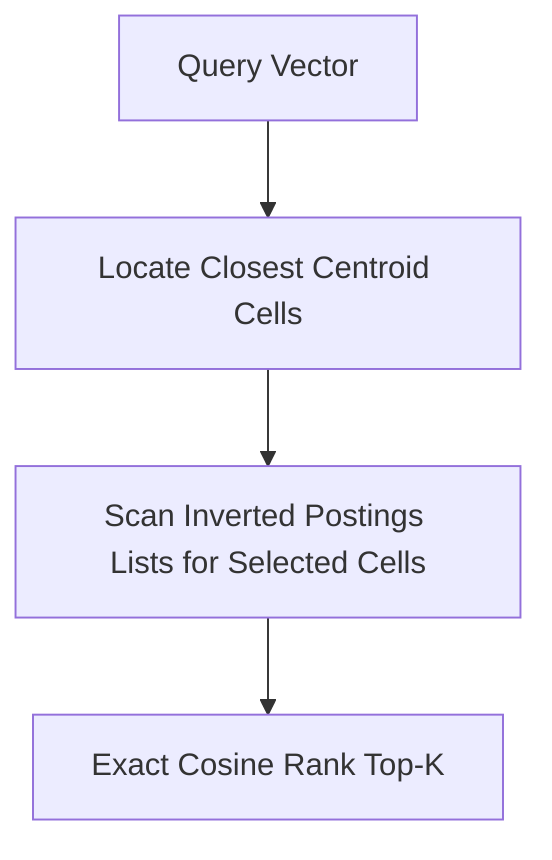

# genpark-inverted-file-ivf-centroid-clusterer-skill

Inverted File (IVF) index segmenting vector space into Voronoi cells for fast pruned vector search.

## Architecture

## Features
- **Configurable nprobe**: Trade-off speed versus recall accuracy.
- **Pure Python**: 100% standard library.
